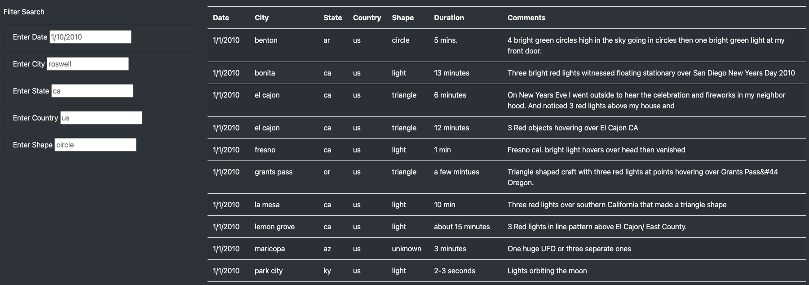
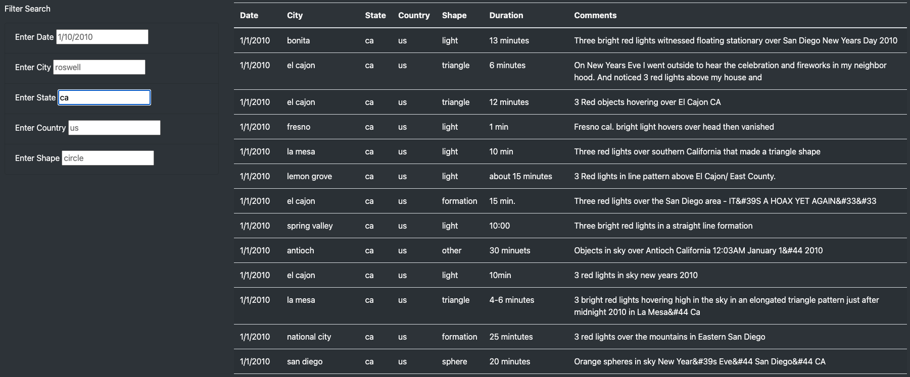
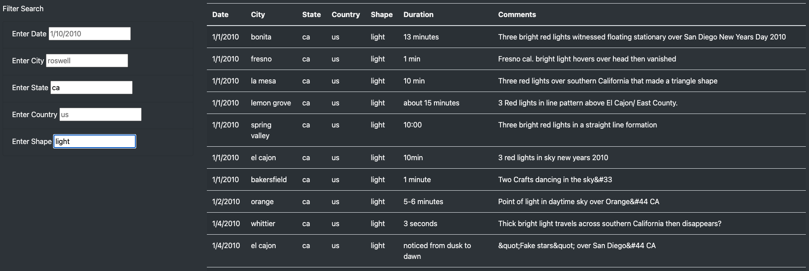

# UFOs

## Overview
### Purpose
In this project, I assisted data journalist, Dana, with creating a dynamic website that presented findings on UFO sightings throughout the country. Through the use of Javascript, HTML, Bootstrap, and CSS, we created a great website that allowed users to filter the sightings data we acquired on certain dates. After we got the dynamic site and table working as expected, we wanted to allow users to drill more specifically into the sightings data through additional filters on city, state, country, and shape of the UFOs.

## Results
Following our updates, users visiting our website will first see our unfiltered table like this:

To the left, they will notice 5 different filter options at their disposal: Date, City, State, Country, and Shape (of the UFOs), with placeholder values to guide them in how to input keywords. 

If a user wanted to filter on only one column, they could type in "ca" in the "Enter State" area and would obtain an updated table that looks like this:

With our increased functionality, users would not be stuck with filtering on one column at a time, but could actually input filters for multiple columns for an added layer of specificity in their searches. For example, if a user want to look for all UFO sightings that looked like "light" in California, they would input "ca" and "light" in the respective fields and receive the following updated table:

These filters help any users visiting our site better excavate the sightings data we provided to find exactly what they're looking for.

## Summary
While our website and dynamic table have exceeded our expectations, one drawback of the new design is its lack of a comprehensive list of possible keywords a user can type into the filters to find what they're looking for. In its current form, users sifting through the data must have some previous knowledge of what they are looking for or will need to read through the table to get an idea of what keywords are present. Two recommendations I would make for further development are:
1. Changing the filter area to drop down menus instead of a typing input area. This would allow for more efficient data analysis from all users that visit our site.
2. Wrapping our table into a smaller window with a scroll bar that would limit the size of our webpage and give everything a more polished look. 
